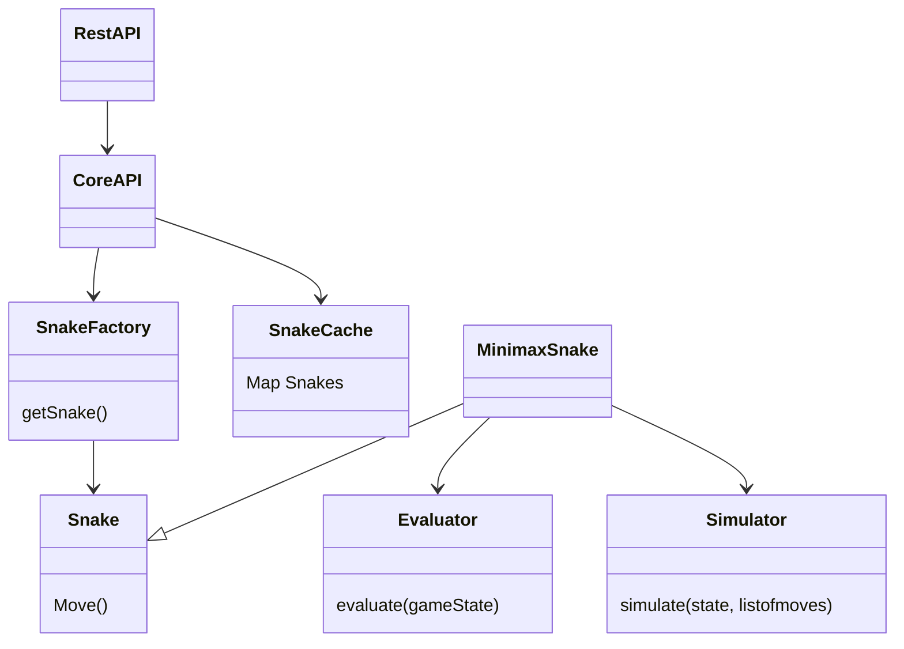

# Project Architecture

Overall Structure of the project

```mermaid
classDiagram
    RestAPI --> CoreAPI
    CoreAPI --> SnakeFactory
    CoreAPI --> SnakeCache
    SnakeCache: Map Snakes
    SnakeFactory: getSnake()
    SnakeFactory --> Snake
    Snake: Move()
    MinimaxSnake --|> Snake
    MinimaxSnake --> Evaluator
    Evaluator: evaluate(gameState)
    MinimaxSnake --> Simulator
    Simulator: simulate(state, listofmoves)
```
